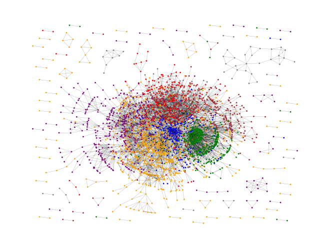
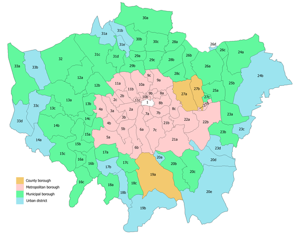

## Data Science Portfolio - Arif Meighan

This portfolio is a compilation of different Data Science and Data Analysis projects I have contributed to. It includes several academic, hobby, and passion projects from which I have learned to expand my understanding of my quantitative studies further. Please contact me if any questions arise from the content shown in the documents:

- **Email**: [ArifMeighan@hotmail.co.uk](ArifMeighan@hotmail.co.uk)
- **LinkedIn**: [linkedin.com/arif-meighan](https://www.linkedin.com/in/arif-meighan/)

## Projects

 **[Steam Game Recommendation system utilizing Collaborative Filtering](https://github.com/Peptidase/ArifMeighan/blob/main/Documents/Distributed_Project_Draft_Final__Copy_for_portfolio_.pdf)**

Utilized alternating least squares algorithm to model the relationship between users and products. The algorithm is capable of providing novel and intuitive game recommendations based on a user's preference for genre, publisher, and developer. It is capable of cold start recommendation where a user has no background of activity to recommend from. Groups of users with similar preferences are recommended games within their group that align with their user-product interaction tuple.

#

 **[Graph Neural Network model comparison]([./Documents/GNN.pdf](https://github.com/Peptidase/ArifMeighan/blob/main/Documents/ST456Group8__Copy_for_portfolio_.pdf))**

A project based on measuring the performance of graph neural networks on the coras citation dataset. Utilizing a dataset with sparse and densely connected nodes allows for an extensive testing environment to observe how the hyperparameters, aggregation methods, and architecture of graph neural networks affect the performance of a model.

#

 **[Geospatial Analysis of Crime in relation to housing prices in London](https://github.com/Peptidase/ArifMeighan/blob/main/Documents/Geospatial.pdf)**

I was interested in analyzing the possible correlation between housing prices and the level of crimes. I observed that ASB (Anti-Social Behaviour) was a good indicator of housing prices but not rental prices. Utilized geospatial vector and raster structures to create chloropleth visualizations of the districts with their respective crime statistics. For a clearer copy of the code please do not hesitate to directly contact me.

 

## Core Competencies

- **Methodologies**: Machine Learning, Deep Learning, Time Series Analysis, Natural Language Processing, Statistics, Explainable AI, A/B Testing and Experimentation Design, Big Data Analytics
- **Languages**: Python (Pandas, NumPy, Scikit-Learn, SciPy, Keras, Matplotlib), R (Dplyr, Tidyr, Caret, Ggplot2), SQL, C++
- **Tools**: MySQL, Git, PySpark, Google Console, Amazon Web services (AWS)

